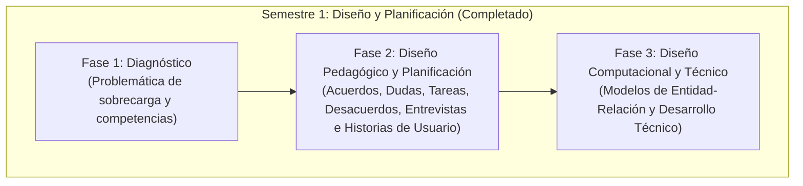

# Documento Base de SICOCO

**Contexto Académico:**
El proyecto **SICOCO (Sintetizador de Co-creación Colaborativa)** nace como una iniciativa de los estudiantes de **8vo semestre** de la **Licenciatura en Informática con énfasis en medios audiovisuales** de la **Universidad de Córdoba**. Desarrollado bajo la materia de **Diseño y Desarrollo de Software Educativo I**, empleando la metodología pedagógica **MODESEC**.

---

## Descripción del Proyecto

SICOCO es una herramienta digital de procesamiento de texto basada en Inteligencia Artificial diseñada para analizar, clasificar y resumir transcripciones de chats y foros de trabajo grupal. Su propósito no es solo resumir información, sino servir como una guía de apoyo que le permita a los estudiantes visualizar cómo colaboran, fomentando el trabajo en equipo.

---

## ¿Por qué Co-Creación?

SICOCO se define fundamentalmente como una plataforma de **co-creación** y no meramente de **creación** (ya sea individual o grupal tradicional). Mientras que las herramientas convencionales de creación se limitan a proporcionar un espacio para redactar un producto final, SICOCO interviene de manera activa y pedagógica en el proceso constructivo que da origen a dicho producto.

Bajo el marco metodológico **MODESEC**, el software se cataloga como una herramienta de co-creación por las siguientes razones esenciales:

1. **Trazabilidad y Evolución de las Ideas (El Tejido Colectivo):** En una herramienta de creación simple, el resultado borra los debates intermedios. SICOCO, en cambio, mapea la evolución del pensamiento grupal. Mediante el *Mapeo de Co-Creación* (reflejado en el modelo relacional con la auto-relación `Conexion_Idea`), el sistema registra de manera cronológica cómo las ideas iniciales propuestas por un miembro del equipo se conectan, complementan o transforman con las intervenciones de otros compañeros.
2. **Foco en el Diálogo y la Negociación Pedagógica:** La co-creación requiere diálogo y confrontación constructiva de saberes. SICOCO procesa y categoriza explícitamente no solo los **Acuerdos**, sino también los **Desacuerdos** y las **Dudas abiertas**. Esto visibiliza la negociación de significados del grupo, demostrando que el conocimiento educativo es el resultado de un consenso dinámico y no de una simple asignación monótona de tareas.
3. **El Rol Mediador de la Inteligencia Artificial:** En este sistema, la IA no crea el contenido por el estudiante, sino que actúa como un espejo metacognitivo que le devuelve al equipo la estructura lógica de su propia discusión. Al clasificar los aportes, la IA facilita que los co-creadores (estudiantes y docentes) reflexionen sobre el curso de su colaboración, tomen control de su propio aprendizaje y afinen su trabajo.
4. **Visibilización de la Agencia y la Corresponsabilidad:** La co-creación pone en valor el aporte singular de cada individuo al logro común. A través del registro de alias y autores integrados en el dashboard y las líneas de tiempo, SICOCO valida la autoría intelectual de cada estudiante, demostrando cómo la suma interactiva y complementaria de los aportes de todos los miembros del equipo define el éxito del proyecto.

---

## El Problema

El entorno de aprendizaje actual exige que los estudiantes trabajen en equipo utilizando herramientas asíncronas y chats de mensajería (WhatsApp, Discord, Teams). Esto genera una **sobrecarga de información**, provocando que valiosas ideas, debates importantes y acuerdos consensuados se pierdan o se olviden en medio de extensas cadenas de mensajes. SICOCO tiene que resolver este problema identificando:

1. **Qué se dice** y los acuerdos alcanzados.
2. **Quién dio cada idea** para validar participaciones.
3. **Cómo el grupo debatió** hasta llegar a la resolución.

---

## La Solución Propuesta

Desarrollar un Producto Mínimo Viable en formato de **extensión de navegador** (compatible con navegadores basados en Chromium) que permita a los estudiantes capturar directamente de la web o cargar de forma asíncrona sus historiales de chat grupal, utilizando Inteligencia Artificial para extraer de forma estructurada los puntos más importantes de la discusión y categorizándolos visualmente.

---

## Usuarios Objetivo

- **Estudiantes Universitarios y Escolares:** Principales beneficiarios que buscan optimizar su tiempo y no perder el hilo de sus proyectos grupales.
- **Docentes / Evaluadores:** Que requieren observar o validar el verdadero nivel de participación, los debates y los consensos a los que llegan los grupos de estudiantes fuera del aula.
- **Equipos de Trabajo General:** Grupos que trabajan de forma remota y necesitan no olvidar las decisiones del proyecto.

---

## Objetivos

### Objetivo General

Desarrollar un Producto Mínimo Viable de la herramienta SICOCO que utilice Inteligencia Artificial para resumir chats colaborativos, estructurando la información según la metodología MODESEC para facilitar la asimilación del aprendizaje en estudiantes de educación superior.

### Objetivos Específicos

1. **Clasificar el contenido** extraído en cuatro ejes fundamentales: Acuerdos, Desacuerdos, Tareas (To-Do) y Dudas sin resolver.
2. **Generar un reporte visual y amigable** (Línea de tiempo y Tableros) que permita al estudiante comprender de un solo vistazo el estatus de su proyecto.
3. **Identificar al autor de las ideas** para destacar el aporte de cada persona al trabajo del equipo.
4. **Validar la utilidad educativa** de la herramienta mediante pruebas de campo (usabilidad y fidelidad técnica) en el entorno universitario.

---

## Fundamentación Metodológica Integral (Modelo MODESEC)

La fundamentación metodológica del proyecto SICOCO se basa en la integración sinérgica del modelo **MODESEC** (Modelo de Organización de Estrategias para el Desarrollo de Software Educativo por Competencias). Este marco no se limita a una simple guía instruccional, sino que se constituye como un ecosistema de organización pedagógica orientado específicamente al diseño de software educativo basado en competencias, evidencias de aprendizaje y mediaciones tecnológicas.

1. **La Primacía del Aprendizaje:** SICOCO se concibe como un sistema que transforma la opacidad de los chats grupales en un proceso transparente de co-creación, donde cada algoritmo y línea de código están supeditados a objetivos formativos validados. La tecnología deja de ser el fin para convertirse en el medio que hace tangible el progreso intelectual del equipo.
2. **Principios Orientadores:** El software debe fortalecer la capacidad del estudiante para trabajar de forma colaborativa, identificando acuerdos y resolviendo dudas de manera autónoma. Cada funcionalidad técnica debe generar o procesar una evidencia observable del desempeño del estudiante.
3. **Framework de Ingeniería:** MODESEC permite segmentar el ciclo de vida del software, priorizando requerimientos que generan evidencias de aprendizaje y alineando la arquitectura de datos con los estándares de calidad educativa y técnica.
4. **Dominio Técnico-Académico:** Gestión de identidades, roles (docente/estudiante) y organización de cursos.
5. **Dominio del Procesamiento Pedagógico:** Núcleo de inteligencia donde el motor de IA aplica filtros metodológicos para transformar el contenido desestructurado.
6. **Dominio de Visualización Educativa:** Diseño de la interfaz gráfica (GUI) para presentar mapas de co-creación y líneas de tiempo.
7. **El Motor de IA y MODESEC:** Se emplea una ingeniería de prompts robusta basada en las categorías de MODESEC para identificar evidencias específicas de desempeño, minimizando alucinaciones tecnológicas.

---

## Fases del Proyecto (Enfoque MODESEC)

### Fase 1: Diagnóstico (Análisis de Competencias)

En este paso definimos qué debe lograr la persona que usa el sistema y qué problema debe resolver la Inteligencia Artificial. La meta principal es: **“Resumir y analizar lo que el grupo habla al trabajar en equipo, sirviendo como una guía de apoyo”.**

### Fase 2: Diseño Pedagógico y Planificación (Formas de Enseñar y Planificar)

SICOCO debe ordenar la información de forma clara. En lugar de dar un resumen aburrido, divide las conclusiones en partes clave:

1. **Acuerdos:** Puntos donde el equipo pensó igual y tomó una decisión.
2. **Desacuerdos u objeciones:** Opiniones diferentes o debates.
3. **Dudas sin resolver:** Preguntas que nadie supo responder al terminar la reunión.
4. **Tareas por hacer:** Próximos pasos a seguir y quién tiene que hacerlos.

El resumen debe mostrar, mediante una **línea de tiempo fácil de leer**, cómo fueron cambiando las ideas principales para demostrar el valor del trabajo en equipo. Además, en esta fase se estructuran las entrevistas de requerimientos con el arquitecto de datos y se definen las historias de usuario y sus criterios de aceptación.

### Fase 3: Diseño Computacional y Técnico (Arquitectura, Modelado y Fundamentación Tecnológica)

Este es el plan básico para desarrollar el programa bajo un modelo **MVP (Producto Mínimo Viable)** en formato de **extensión de navegador**.

- **Entrada de Datos (Básica y Segura):** Se proveerá una interfaz integrada en la extensión que permitirá a los estudiantes capturar el historial de chats directamente desde las pestañas web activas (WhatsApp Web, Discord, Teams) a través de la lectura del DOM, o bien cargar manualmente archivos de historial exportados (txt, csv, JSON).
- **Modelado de Datos (MER):** Se diseña la estructura lógica-física de la base de datos relacional (19 tablas normalizadas) para garantizar la integridad referencial y el almacenamiento del procesamiento de IA.
- **El Motor de SICOCO (Desarrollo Técnico):** Consumirá APIs de Inteligencias Artificiales generativas de bajo costo o capa gratuita (como Gemini o OpenAI). Se utilizará un sistema robusto de instrucciones estructuradas (**Ingeniería de Prompts**), en lugar de entrenar una IA desde cero (fine-tuning).
- **Pantalla para el Usuario (UI):** Se construirá una interfaz gráfica integrada en la extensión (Dashboard) estructurada y clara para exponer visualmente los elementos extraídos (autor, tareas pendientes, acuerdos).

### Fase 4: Producción y Desarrollo

Se programará la interfaz gráfica de la extensión, la lógica de lectura del DOM de las pestañas web y cómo el backend se conecta a la API de IA.

- **Ingeniería de Prompts:** La parte más crítica será perfeccionar las instrucciones para minimizar alucinaciones y extraer información precisa.
- **Tipos de Textos:** El sistema deberá manejar chats rápidos y cortos (WhatsApp/Telegram) así como foros ordenados y formales, adaptándose al ritmo conversacional.

### Fase 5: Evaluación (Pruebas de Campo)

Se evaluará la utilidad educativa mediante tres pruebas controladas:

1. **Prueba de Precisión (Test Técnico):** Comprobar si el resumen refleja los acuerdos reales y detecta alucinaciones.
2. **Revisión de Facilidad de Uso (Usabilidad):** Evaluar si la interfaz es agradable, clara y diferencia bien las categorías (Acuerdos, Tareas).
3. **Prueba de Utilidad Educativa:** Encuestar a los usuarios para saber si el sistema mejoró su comprensión de los objetivos y el trabajo en equipo.

### Fase 6: Implementación y Seguimiento

Pondremos SICOCO a prueba en un curso real (Programa Piloto) por un tiempo definido. Se recopilará la opinión de los usuarios para mejorar el sistema y se contemplan futuras mejoras, como permitir elegir el estilo del resumen (Serio para informes, Rápido para reuniones de seguimiento).

---

## Supuestos

- Se asume que los estudiantes saben exportar o trasladar chats desde sus plataformas de mensajería (ej. WhatsApp) al sistema.
- Se asume que los equipos mantienen una comunicación escrita lo suficientemente clara y estructurada para que una IA identifique intenciones de trabajo.
- Se cuenta con acceso a APIs de IA generativa bajo los planes gratuitos o en cuotas financiables por estudiantes.

---

## Posibles Riesgos

- **Alucinación de la IA:** Que el modelo de lenguaje genere acuerdos o asigne tareas que el grupo nunca mencionó en realidad.
- **Resistencia al uso:** Que a los estudiantes les parezca tedioso el proceso de proveer el historial del chat al sistema.
- **Mala calidad de datos de entrada:** Que el chat esté lleno de audios, imágenes o stickers, limitando fuertemente el texto que la IA puede procesar.

---

## Preguntas Frecuentes (FAQ)

- **¿SICOCO funciona en tiempo real conectado a WhatsApp?**
  No. Por razones de viabilidad y privacidad en este MVP, se requiere capturar la conversación de forma voluntaria a través de la extensión o cargar el archivo de chat.
- **¿Qué tipo de chats puede analizar?**
  Historiales generados por plataformas de comunicación colaborativa (WhatsApp, Discord, Teams) ya sea capturando el DOM desde su interfaz web mediante la extensión o cargando archivos de conversación (.txt, .csv, .json).
- **¿Es seguro usarlo con tareas de la Universidad?**
  Sí, SICOCO procesará el texto sin almacenar datos sensibles por tiempo indefinido, enfocándose puramente en la extracción de aprendizaje.

---

## Criterios de Éxito

- La herramienta es capaz de leer un chat de al menos 100 mensajes y generar una síntesis funcional sin errores técnicos (timeouts).
- La precisión en la extracción de Tareas (qué hacer y quién debe hacerlo) resulta verídica frente a una revisión humana manual.
- El sistema se despliega en una interfaz accesible y cuenta con el feedback cualitativo positivo de los usuarios de prueba en la etapa de evaluación piloto.

---

## Entrevista Técnica: Arquitectura de Datos de SICOCO

**Rol:** Arquitecto de Datos Senior  
**Objetivo:** Identificar los requerimientos para el modelado de la base de datos relacional del proyecto SICOCO, extrayendo las entidades, atributos y relaciones necesarias.

### Bloque 1: Usuarios, Roles y Organización Académica

**1. ¿Qué datos personales y académicos debemos registrar sobre cada estudiante que utilice SICOCO?**
> **Posible Respuesta (Datos):** Entidad `Estudiante` necesita almacenar: `ID_Estudiante` (Llave primaria), `Numero_Identidad_Matricula`, `Nombres`, `Apellidos`, `Correo_Institucional`, `Contraseña_Encriptada`, `Semestre_Actual`, `Programa_Academico` (Ej. Lic. en Informática), y `Fecha_Registro`.

**2. ¿Existen otros tipos de usuarios en el sistema además de los estudiantes, como profesores o administradores?**
> **Posible Respuesta (Datos):** Sí, necesitamos una entidad `Rol` o bien atributos extendidos para `Profesor`: `ID_Profesor`, `Numero_Empleado`, `Nombres`, `Apellidos`, `Departamento`, y nivel de `Permiso_Sistema`.

**3. ¿Cómo organizamos a los estudiantes académicamente dentro del sistema?**
> **Posible Respuesta (Datos):** A través de asignaturas o cursos. Entidad `Curso`: `ID_Curso`, `Codigo_Materia`, `Nombre_Materia` (Ej. Diseño de Software Educativo I), `Semestre_Academico` (Ej. 2026-1), y `ID_Profesor_Responsable`.

**4. Ya que SICOCO se basa en proyectos grupales, ¿cómo estructuramos los equipos de trabajo?**
> **Posible Respuesta (Datos):** Entidad `Equipo`: `ID_Equipo`, `Nombre_Equipo`, `ID_Curso` (asociado a qué curso pertenece), y `Fecha_Creacion`.

**5. ¿Cómo gestionamos a los integrantes de los equipos? ¿Un estudiante puede estar en varios equipos?**
> **Posible Respuesta (Datos):** Sí, se necesita una tabla intermedia `Miembro_Equipo`: `ID_Relacion`, `ID_Estudiante`, `ID_Equipo`, `Rol_En_Equipo` (Ej. Líder, Participante), y `Fecha_Union`.

### Bloque 2: Entradas de Datos (Chats y Sesiones de Trabajo)

**6. Cuando un equipo se reúne a discutir un proyecto, ¿qué datos guarda SICOCO de la propia reunión o sesión?**
> **Posible Respuesta (Datos):** Entidad `Sesion_Trabajo`: `ID_Sesion`, `ID_Equipo`, `Fecha_Reunion`, `Objetivo_General`, `Plataforma_Origen` (Ej. Discord, Teams, WhatsApp), y `Duracion_Estimada`.

**7. Los usuarios proveen el registro de su chat al sistema. ¿Qué información guardamos sobre este ingreso?**
> **Posible Respuesta (Datos):** Entidad `Registro_Chat`: `ID_Registro`, `ID_Sesion`, `Origen_Metadata` (URL, Path o Buffer), `Formato_Entrada` (txt, csv, JSON), `Tamaño_Datos`, y el `ID_Estudiante_Ingresa`.

**8. Antes del resumen, ¿es necesario guardar cada mensaje individual del chat en la base de datos por separado?**
> **Posible Respuesta (Datos):** Serviría mucho para precisión. Entidad `Mensaje_Original`: `ID_Mensaje`, `ID_Registro`, `Alias_Remitente`, `Cuerpo_Del_Mensaje` (Texto), `Fecha_Hora_Mensaje` (Timestamp).

### Bloque 3: Procesamiento de IA (Ingeniería de Prompts y Motor)

**9. SICOCO utiliza distintos "tonos" o configuraciones para decirle a la IA cómo resumir. ¿Cómo guardamos estas instrucciones maestras (prompts)?**
> **Posible Respuesta (Datos):** Entidad `Configuracion_Prompt`: `ID_Configuracion`, `Nombre_Estilo` (Ej. Rápido, Serio/Formal), `Texto_Instruccion_IA`, y `Estado_Activo` (Booleano).

**10. ¿Qué detalles guardamos cuando el sistema finalmente produce un resumen del chat entero?**
> **Posible Respuesta (Datos):** Entidad `Resumen_Generado`: `ID_Resumen`, `ID_Sesion`, `ID_Configuracion` (FK a Configuracion_Prompt), `Texto_Final_Plano` (por si la vista falla), `Modelo_IA_Usado` (Ej. Gemini-1.5, OpenAI), `Consumo_Tokens`, y `Fecha_Generacion`.

### Bloque 4: Pilares de Información (Los 4 Puntos Clave de Salida)

**11. Del punto pedagógico, sabemos que debemos capturar "Acuerdos". ¿Qué atributos componen un "Acuerdo"?**
> **Posible Respuesta (Datos):** Entidad `Acuerdo_Equipo`: `ID_Acuerdo`, `ID_Resumen`, `Descripcion_Solucion`, `Nivel_Importancia` (Alto/Medio/Bajo), y el/los `Alias_Quien_Propone`.

**12. También el resumen separa "Desacuerdos o Posturas Encontradas". ¿Qué datos nos pide esto?**
> **Posible Respuesta (Datos):** Entidad `Desacuerdo`: `ID_Desacuerdo`, `ID_Resumen`, `Tema_Debate`, `Descripcion_Oposicion`, y `Estado_Resolucion` (Resuelto / Activo).

**13. Para las "Dudas sin Resolver" que quedan al final de la reunión, ¿qué debemos registrar?**
> **Posible Respuesta (Datos):** Entidad `Duda_Abierta`: `ID_Duda`, `ID_Resumen`, `Pregunta_Principal`, `Relacionado_Con_Tema` (Ej. Base de datos, Interfaz).

**14. SICOCO crea un "To-Do" (Tareas a hacer). ¿Cuáles son las columnas indispensables para la base de datos de las Tareas?**
> **Posible Respuesta (Datos):** Entidad `Tarea_Asignada`: `ID_Tarea`, `ID_Resumen`, `Titulo_Actividad`, `ID_Estudiante_Asignado` (FK al estudiante), `Estatus` (Pendiente, En Proceso, Hecha), y `Fecha_Limite` o sugerida.

### Bloque 5: Mapeo de Co-Creación (Línea de Tiempo)

**15. Mencionaste mostrar cómo evolucionan las ideas con una "Línea de tiempo". ¿Cómo guardaremos esta cronología de forma estructurada?**
> **Posible Respuesta (Datos):** Entidad `Momento_Clave_Chat`: `ID_Momento`, `ID_Resumen`, `Marca_Tiempo_Aproximada`, `ID_Mensaje_Relacionado`, `Alias_Usuario`, y `Evento` ("Idea Nueva", "Solución", "Pregunta").

**16. ¿La base de datos buscará relacionar u enlazar quién aportó a la solución final de qué otra persona?**
> **Posible Respuesta (Datos):** Puede requerir una Tabla de Relación Recursiva o intermedia `Conexion_Idea`: `ID_Idea_Base`, `ID_Aporte_Extra`, para dibujar cómo las ideas se alimentan mutuamente en la vista.

### Bloque 6: Evaluación y Pruebas (Feedback de la Herramienta)

**17. Si hacemos una prueba técnica al resumen (Fase 5), ¿qué información se audita sobre la calidad del resumen?**
> **Posible Respuesta (Datos):** Entidad `Control_Calidad_Bot`: `ID_Test`, `ID_Resumen`, `Cantidad_Falsos_Positivos`, `Calificacion_Fidelidad_texto` (Del 1 al 10), y `Comentario_Técnico`.

**18. En la "Prueba de Facilidad de Uso", recogeremos datos de experiencia del usuario (UX). ¿Qué se guardará aquí?**
> **Posible Respuesta (Datos):** Entidad `Evaluacion_UX`: `ID_Eval_UX`, `ID_Estudiante`, `Claridad_Visual` (1-5), `Separacion_Vista_Tareas` (Booleano: ¿Fue claro?), y `Sugerencias_Extra` (Texto grande).

**19. Queremos medir el impacto educativo en los estudiantes (si sienten que mejoró su trabajo). ¿Qué atributos forman esa encuesta de "Utilidad"?**
> **Posible Respuesta (Datos):** Entidad `Encuesta_Piloto`: `ID_Encuesta`, `ID_Estudiante`, `Mejor_Comprension_Objetivos_Si_No` (Booleano), `Nivel_de_Apoyo_En_Grupo` (Escala Likert 1 al 5), y `Fecha_Respuesta`.

### Bloque 7: Escalabilidad, Privacidad y Seguridad

**20. Como SICOCO alberga los chats de personas y puede escalar a un entorno universitario permanente, ¿qué campos de infraestructura y permisos tenemos para asegurar su privacidad?**
> **Posible Respuesta (Datos):** Cada tabla requerirá campos de `Created_At` (Fecha creación) y `Updated_At`. El registro del chat tendrá una bandera `Es_Confidencial` y los equipos de trabajo `Requiere_Aprobacion_Profesor`. Los IDs deben ser encriptados o en formato UUID para evitar fuga o que otros equipos miren los acuerdos de la competencia.

---

## Comparativa: Modelo Entidad-Relación vs. Entrevista Técnica

Para garantizar la viabilidad y robustez técnica de SICOCO, se presenta un análisis comparativo de correspondencia entre los requerimientos narrados en la **Entrevista Técnica (Arquitectura de Datos)** y la modelación física/lógica expresada en el **Modelo Entidad-Relación (MER)**:

### 1. Matriz de Trazabilidad e Integridad de Datos

| Bloque de la Entrevista | Requerimiento / Preguntas | Entidad(es) Mapeada(s) | Atributos clave del Modelo Relacional |
| :--- | :--- | :--- | :--- |
| **Bloque 1:** Usuarios, Roles y Organización | Estudiantes, profesores, cursos, equipos y membresías. | `Estudiante`, `Profesor`, `Curso`, `Equipo`, `Miembro_Equipo` | `Numero_Identidad_Matricula`, `Semestre_Actual`, `Numero_Empleado`, `Permiso_Sistema`, `Codigo_Materia`, `Nombre_Equipo`, `Rol_En_Equipo`. |
| **Bloque 2:** Entradas de Datos (Chats y Sesiones) | Reuniones lógicas de trabajo, archivos de historial subidos y mensajes crudos de chat. | `Sesion_Trabajo`, `Registro_Chat`, `Mensaje_Original` | `Objetivo_General`, `Plataforma_Origen`, `Origen_Metadata`, `Formato_Entrada`, `Alias_Remitente`, `Cuerpo_Del_Mensaje`. |
| **Bloque 3:** Procesamiento de IA | Catálogo de instrucciones/prompts maestros y almacenamiento de resúmenes de sesiones. | `Configuracion_Prompt`, `Resumen_Generado` | `Nombre_Estilo`, `Texto_Instruccion_IA`, `Texto_Final_Plano`, `Modelo_IA_Usado`, `Consumo_Tokens`. |
| **Bloque 4:** Pilares de Información (Salidas IA) | Extracción clasificada de acuerdos, desacuerdos, dudas del grupo y compromisos asignados. | `Acuerdo_Equipo`, `Desacuerdo`, `Duda_Abierta`, `Tarea_Asignada` | `Descripcion_Solucion`, `Nivel_Importancia`, `Tema_Debate`, `Estado_Resolucion`, `Pregunta_Principal`, `Titulo_Actividad`, `Estatus`, `Fecha_Limite`. |
| **Bloque 5:** Mapeo de Co-Creación | Hitos del chat para la línea de tiempo y la interconexión causal de aportes de ideas. | `Momento_Clave_Chat`, `Conexion_Idea` (auto-relación) | `Marca_Tiempo_Aproximada`, `Evento`, `ID_Idea_Base`, `ID_Aporte_Extra`. |
| **Bloque 6:** Evaluación y Pruebas | Test de precisión técnica (IA), facilidad de uso (UX) y encuesta piloto de utilidad pedagógica. | `Control_Calidad_Bot`, `Evaluacion_UX`, `Encuesta_Piloto` | `Cantidad_Falsos_Positivos`, `Calificacion_Fidelidad_texto`, `Claridad_Visual`, `Separacion_Vista_Tareas`, `Mejor_Comprension_Objetivos`. |
| **Bloque 7:** Seguridad y Privacidad | Fechas de auditoría, visibilidad restringida y blindaje lógico. | Todas las tablas del sistema | `Created_At`, `Updated_At`, `Es_Confidencial` (en `Registro_Chat`), `Requiere_Aprobacion_Profesor` (en `Equipo`). |

### 2. Decisiones de Diseño y Ajustes de Ingeniería

El paso de requerimientos narrativos a una base de datos relacional normalizada requirió tres decisiones de arquitectura críticas:

1. **Desacoplamiento de Remitentes de Chat (`Alias_Remitente` vs. `ID_Estudiante`):** Dado que los chats exportados (WhatsApp/Discord) contienen nombres de usuarios externos no registrados, se almacena `Alias_Remitente` (VARCHAR) en lugar de una FK en mensajes e hitos. Esto evita caídas del sistema y mantiene la flexibilidad. La clave foránea estricta a la tabla `Estudiante` se aplica únicamente en asignaciones directas de la aplicación (como `Tarea_Asignada`).
2. **Modelado de la Línea de Tiempo de Co-Creación (`Conexion_Idea`):** Para registrar el tejido en el que una idea inicial inspira o detona otra propuesta, se implementó una relación reflexiva muchos a muchos (auto-relación) en la entidad `Momento_Clave_Chat` mediante la tabla intermedia `Conexion_Idea`.
3. **Auditoría de Carga Independiente (`Registro_Chat`):** Se separó la sesión lógica de trabajo de los archivos físicos cargados. Esto permite registrar múltiples fuentes de chat en una misma reunión, auditando tamaño, formato e identidad del estudiante que realiza la carga sin redundancias.

---

## Matriz de Historias de Usuario - Proyecto SICOCO

**Basado en Arquitectura de Datos y Metodología MODESEC**

### ZONA 1: Usuarios, Roles y Organización (PER)

**Entidades:** Estudiante, Profesor, Administrador, Curso y Equipo.

| ID | Historia (Como / Quiero / Para) | Valor | Prioridad | Dependencias | Criterios de aceptación |
| :--- | :--- | :---: | :---: | :---: | :--- |
| **PER-01** | Como estudiante, quiero registrarme con mi ID, programa y semestre para ser identificado en el sistema. | Alta | Must | Ninguna | Dado que ingreso mis datos académicos. Cuando guardo Entonces se crea el registro en la entidad Estudiante. |
| **PER-02** | Como docente, quiero vincularme a una asignatura para supervisar los grupos de trabajo. | Alta | Must | PER-01 | Dado que el usuario tiene rol Docente. Cuando selecciona una asignatura Entonces queda asignado como mentor del curso. |
| **PER-03** | Como estudiante, quiero poder actualizar mi contraseña desde mi perfil para mantener mi cuenta segura sin depender de envíos de correo. | Media | Should | PER-01 | Dado que estoy logueado. Cuando voy a mi perfil y edito la clave Entonces se actualiza en la base de datos localmente. |
| **PER-04** | Como integrante de equipo, quiero ser vinculado a un ID_Equipo para trabajar colaborativamente. | Alta | Must | PER-01 | Dado un grupo creado. Cuando el admin me añade Entonces mi ID se relaciona con el ID_Equipo. |

### ZONA 2: Entradas y Sesiones de Trabajo (SES)

**Manejo de la entidad:** Reunión, Registro_Chat y Mensajes individuales.

| ID | Historia (Como / Quiero / Para) | Valor | Prioridad | Dependencias | Criterios de aceptación |
| :--- | :--- | :---: | :---: | :---: | :--- |
| **SES-01** | Como estudiante, quiero crear una Sesión de Trabajo con fecha y hora para iniciar la co-creación. | Alta | Must | PER-04 | Dado un ID_Equipo. Cuando se abre la sesión Entonces se genera el registro en la entidad Sesion_Trabajo. |
| **SES-02** | Como estudiante, quiero ingresar el historial de chat para que el sistema administre el registro físico/digital. | Alta | Must | SES-01 | Dado un registro de chat. Cuando se ingresa Entonces se guarda la ruta, origen o metadata en la tabla Registro. |
| **SES-03** | Como sistema, quiero separar los mensajes individuales (Cuerpo y Autor) para analizarlos por separado. | Alta | Must | SES-02 | Dado un registro ingresado. Cuando se procesa Entonces cada línea se guarda con su ID_Autor y Marca_Tiempo. |
| **SES-04** | Como usuario, quiero ver el historial de registros ingresados por sesión para evitar duplicar información. | Media | Should | SES-02 | Dado una sesión activa. Cuando consulto registros Entonces el sistema lista las fechas y orígenes de carga. |

### ZONA 3: Motor de IA y Procesamiento (IA)

**Uso de:** Ingeniería de Prompts y categorización (Acuerdos, Tareas, Dudas).

| ID | Historia (Como / Quiero / Para) | Valor | Prioridad | Dependencias | Criterios de aceptación |
| :--- | :--- | :---: | :---: | :---: | :--- |
| **IA-01** | Como sistema, quiero categorizar mensajes en Acuerdos, Dudas y Tareas para estructurar la síntesis. | Alta | Must | SES-03 | Dado el texto del chat. Cuando la IA procesa Entonces asigna una categoría a cada punto clave. |
| **IA-02** | Como sistema, quiero extraer tareas (To-Do) con descripción y responsable para organizar el trabajo. | Alta | Must | IA-01 | Dado un compromiso detectado. Cuando la IA lo procesa Entonces se crea una fila en la tabla Tarea con su Responsable. |
| **IA-03** | Como estudiante, quiero que la IA identifique dudas sin resolver para que el grupo las retome luego. | Media | Should | IA-01 | Dado una pregunta sin respuesta en el chat. Cuando termina el análisis Entonces se lista en Dudas_Pendientes. |
| **IA-04** | Como sistema, quiero identificar los temas más repetidos (palabras clave) para que el grupo sepa en qué se enfocaron más. | Baja | Could | IA-01 | Dado el texto del chat. Cuando la IA procesa Entonces genera una lista simple de los temas más frecuentes. |

### ZONA 4: Visualización y Línea de Tiempo (GUI)

**Entidades:** Mapeo de Co-creación y visualización de hitos.

| ID | Historia (Como / Quiero / Para) | Valor | Prioridad | Dependencias | Criterios de aceptación |
| :--- | :--- | :---: | :---: | :---: | :--- |
| **GUI-01** | Como estudiante, quiero ver una línea de tiempo con los hitos del chat para entender la evolución de las ideas. | Alta | Should | IA-01 | Dado el resumen generado. Cuando cargo la vista Entonces se muestran los elementos de la tabla Hito_Cronologico. |
| **GUI-02** | Como usuario, quiero ver el nombre del autor original junto a cada acuerdo o idea para reconocer quién lo propuso. | Media | Should | GUI-01 | Dado un resumen generado. Cuando leo los acuerdos Entonces veo el alias del autor al lado en texto plano. |
| **GUI-03** | Como estudiante, quiero elegir entre un estilo de resumen Serio o Rápido según mi necesidad. | Media | Could | IA-04 | Dado el resumen finalizado. Cuando selecciono estilo Entonces la visualización cambia el nivel de detalle. |
| **GUI-04** | Como estudiante, quiero ver el resumen dividido por categorías para leer solo lo que me interesa. | Alta | Must | IA-01 | Dado el resumen generado. Cuando se carga el dashboard Entonces aparecen pestañas por cada categoría. |

### ZONA 5: Evaluación y Seguridad (EVA)

**Control de Calidad:** Auditoría y Privacidad (Created_At, Updated_At).

| ID | Historia (Como / Quiero / Para) | Valor | Prioridad | Dependencias | Criterios de aceptación |
| :--- | :--- | :---: | :---: | :---: | :--- |
| **EVA-01** | Como docente, quiero calificar la fidelidad del resumen (1-10) para evaluar el desempeño técnico. | Media | Should | GUI-01 | Dado un resumen revisado. Cuando el docente califica Entonces se guarda en Control_Calidad_IA. |
| **EVA-02** | Como estudiante, quiero poder editar manualmente el resumen generado por la IA para corregir pequeños errores antes de guardarlo. | Alta | Must | GUI-01 | Dado un resumen en pantalla. Cuando presiono "Editar" Entonces se abre un campo de texto para corregirlo y guardarlo. |
| **EVA-03** | Como administrador, quiero un historial de modificaciones para auditar quién cambió un resumen. | Alta | Must | GUI-01 | Dado un cambio en los datos. Cuando se guarda Entonces se actualiza el campo Updated_At y el ID_Editor. |
| **EVA-04** | Como sistema, quiero restringir el acceso a usuarios no autorizados para proteger la privacidad del grupo. | Alta | Must | PER-04 | Dado un intento de consulta anónima. Cuando se valida el rol Entonces el sistema bloquea la vista si no pertenece al equipo. |

---

## Desarrollo Técnico

### 1. Objetivo del Sistema

El objetivo de **SICOCO** es servir como una herramienta digital de procesamiento de texto basada en **Inteligencia Artificial** diseñada para analizar, clasificar y resumir transcripciones de chats y foros de trabajo grupal. El sistema busca transformar la opacidad de las discusiones asíncronas en un proceso transparente de co-creación, permitiendo a los estudiantes visualizar cómo colaboran y facilitando el seguimiento docente bajo la metodología **MODESEC**.

### 2. Perfiles de Usuario

- **Estudiante (Usuario Principal):** Responsable de ingresar los historiales de chat, visualizar los resúmenes, gestionar sus tareas asignadas y evaluar la utilidad de la herramienta.

- **Docente / Evaluador:** Vinculado a asignaturas para supervisar los niveles de participación, validar consensos alcanzados por los equipos y calificar la fidelidad técnica del sistema.
- **Administrador:** Encargado de la gestión de roles, mantenimiento técnico y seguridad global de la infraestructura de datos.

### 3. Funcionalidades del Software (MVP)

El despliegue final se ha definido como una **extensión de navegador** (compatible con navegadores basados en Chromium) para facilitar la captura e importación directa de datos desde plataformas de mensajería en sus versiones web.

#### A) Módulo de Captura y Procesamiento (IA)

- **Captura Directa e Ingreso de Historiales:** Capacidad para capturar y extraer mensajes directamente desde la interfaz web de plataformas de mensajería (WhatsApp Web, Discord Web, Teams Web) leyendo el DOM de la pestaña activa en el navegador. Asimismo, permite la carga de archivos de chat exportados (txt, csv, JSON) de forma asíncrona.

- **Motor de SICOCO:** Consumo de APIs de IA generativa (Gemini/OpenAI) mediante una **Ingeniería de Prompts** robusta para minimizar alucinaciones.
- **Categorización Pedagógica:** Identificación automática de cuatro ejes fundamentales:
  - **Acuerdos:** Puntos de consenso y decisiones tomadas.
  - **Desacuerdos:** Posturas encontradas y debates en curso.
  - **Dudas:** Interrogantes sin resolver al finalizar la sesión.
  - **Tareas (To-Do):** Compromisos, responsables y fechas límite.

#### B) Visualización y Dashboard (GUI)

- **Línea de Tiempo de Co-creación:** Representación visual de cómo evolucionaron las ideas y los hitos cronológicos del equipo.

- **Identificación de Autores:** Reconocimiento de quién aportó cada idea o solución para validar la participación individual.
- **Estilos de Resumen:** Opción de elegir entre un tono "Serio" (para informes) o "Rápido" (para seguimiento directo).
- **Edición Manual:** Permite al estudiante corregir errores del resumen generado antes del almacenamiento final.

### 4. Arquitectura de Datos (Modelo Relacional)

El sistema se organiza en **6 dominios funcionales** con un total de **19 entidades**:

- **Dominio Técnico-Académico:** Tablas de *Estudiante*, *Profesor*, *Curso*, *Equipo* y *Miembro_Equipo* para gestionar identidades y jerarquías.
- **Sesiones de Trabajo:** *Sesion_Trabajo*, *Registro_Chat* y *Mensaje_Original* para auditar el insumo crudo.
- **Procesamiento IA:** *Configuracion_Prompt* y *Resumen_Generado* para manejar la lógica del motor de IA.
- **Pilares de Información:** Entidades específicas para *Acuerdo_Equipo*, *Desacuerdo*, *Duda_Abierta* y *Tarea_Asignada*.
- **Mapeo de Co-creación:** *Momento_Clave_Chat* y la tabla recursiva *Conexion_Idea* para construir el grafo de interacciones.
- **Evaluación y Calidad:** *Control_Calidad_Bot*, *Evaluacion_UX* y *Encuesta_Piloto* para medir el impacto educativo y técnico.

### 5. Flujos Críticos

1. **Procesamiento de Chat:** El estudiante captura el chat vía extensión -> La IA categoriza mensajes -> Se genera un resumen estructurado en el Dashboard.
2. **Seguimiento Docente:** El docente accede al curso -> Revisa los acuerdos y tareas de los equipos -> Evalúa la fidelidad del resumen frente al chat original.

### 6. Requisitos No Funcionales y Seguridad

- **Privacidad:** Blindaje lógico de accesos; los estudiantes solo ven material de sus equipos respectivos.

- **Auditoría:** Campos obligatorios de `Created_At` y `Updated_At` en todas las tablas para trazabilidad de cambios.
- **Integridad:** Uso de UUIDs para identificadores sensibles y encriptación de contraseñas mediante hash.
- **Escalabilidad:** Desacoplamiento de remitentes (Alias) para permitir el procesamiento de usuarios externos no registrados en la plataforma.

### 7. Roadmap de Desarrollo (Fases MODESEC)

1. **Diagnóstico:** Definición de competencias y problemas de sobrecarga informativa (Completado).
2. **Diseño Pedagógico y Planificación:** Estructuración de categorías (Acuerdos, Tareas, etc.), entrevistas de requerimientos e historias de usuario (Completado).
3. **Diseño Computacional y Técnico:** Modelos de entidad-relación (MER), diseño del desarrollo técnico y arquitectura del MVP (Completado).
4. **Producción y Desarrollo:** Programación del frontend (extensión), backend e ingeniería de prompts.
5. **Evaluación:** Pruebas de precisión técnica, usabilidad (UX) y utilidad educativa.
6. **Implementación:** Programa piloto en cursos reales de la Universidad de Córdoba.

---

## Alcance al Cierre del Primer Semestre: Evolución, Colaboración y Estado del Proyecto

Este apartado resume el estado real del proyecto **SICOCO** al cierre de este periodo académico, detallando cómo se estructuró el trabajo y la división de tareas entre el equipo de estudiantes y el asistente de IA.

### 1. Cronología y Evolución del Proyecto

El desarrollo del proyecto se organizó siguiendo las directrices de la metodología **MODESEC** (Modelo de Organización de Estrategias para el Desarrollo de Software Educativo por Competencias) para enfocar el esfuerzo de diseño desde una perspectiva pedagógica.

#### Tabla de Hitos de Documentación

| Archivo / Documento | Fase / Tema | Contenido Clave Detallado |
| :--- | :--- | :--- |
| **00_documento_base.md** | General / Introducción | Contexto del 8vo semestre, diagnóstico del problema de la sobrecarga de información y los objetivos principales del proyecto. |
| **01_diagnostico.md** | Fase 1: Diagnóstico | Delimitación del problema de sobrecarga y definición del perfil de usuario y la meta del sistema. |
| **02_diseno_pedagogico.md** | Fase 2: Diseño Pedagógico | Estructura de organización en acuerdos, desacuerdos, tareas y dudas, más el modelado de la línea de tiempo. |
| **03_diseno_computacional.md** | Fase 3: Diseño Computacional | Diseño lógico y especificación técnica de la base de datos (MER) y del backend/extensión. |
| **04_produccion_desarrollo.md** | Fase 4: Producción (Plan) | Lineamientos para el desarrollo de la extensión y refinamiento de prompts para diferentes fuentes de texto. |
| **05_evaluacion.md** | Fase 5: Evaluación (Plan) | Metodología de validación basada en precisión técnica, usabilidad y utilidad educativa. |
| **06_implementacion_seguimiento.md** | Fase 6: Implementación (Plan) | Planificación del programa piloto en la Universidad de Córdoba y de mejoras continuas. |
| **07A_entrevista_preguntas.md** y **07B_entrevista_respuestas.md** | Requerimientos | Cuestionario y respuestas simuladas con el Arquitecto de Datos para extraer los requerimientos del MER. |
| **08_historias_usuario.md** | Requisitos Funcionales | Historias de usuario ordenadas en 5 zonas funcionales del sistema con criterios de aceptación. |
| **09_fundamentación_metodológica.md** | Fundamento Pedagógico | Detalle del impacto formativo del sistema y la aliniación metodológica con la taxonomía y prompts. |
| **10_modelo_entidad_relación.md** | Diseño de Base de Datos | Definición formal de las 19 tablas, atributos, llaves, tipos y cardinalidades del modelo. |
| **11_comparativa_modelo_entrevista.md** | Validación de Datos | Matriz de trazabilidad cruzada entre las preguntas de la entrevista y las entidades creadas. |
| **12_desarrollo_técnico.md** | Arquitectura del MVP | Especificaciones técnicas del motor de IA, flujos críticos, requerimientos de seguridad y roadmap. |

### 2. División del Trabajo: ¿Quién hizo qué?

El diseño final del proyecto representa una labor conjunta de ingeniería y refinamiento metodológico:

#### Colaboración de la IA (Antigravity)

- **Generación de Estructuras Base:** Modelado inicial conforme a las fases del framework MODESEC.

- **Modelo Relacional Lógico (DBML):** Normalización de las 19 entidades y diseño del código DBML (`diagrama_bd.dbml`), asegurando que las tablas como `Configuracion_Prompt` quedaran integradas sin desconexiones lógicas.
- **Matrices de Trazabilidad:** Cruce automatizado para corroborar la alineación del diseño físico con los requisitos de la entrevista.
- **Especificaciones Técnicas:** Conversión de conceptos pedagógicos en atributos de base de datos y flujos lógicos con APIs de lenguaje (LLM).

#### Aportes del Equipo de Trabajo (Manual)

- **Contextualización y Refinamiento:** Ajuste y adecuación de las definiciones y problemáticas a la realidad institucional y académica del 8vo semestre.

- **Consistencia de Estilo (Prettier):** Formateo estricto del lenguaje markdown para una lectura uniforme en todos los documentos.
- **Corrección de Errores e Integración Visual:** Depuración de la nomenclatura en los modelos de datos y vinculación de archivos gráficos del diseño (`Modelo Relacion - Entidad V2.png`, `DBDiagram.png`, `Modelo Relacion - Entidad V2pdf.pdf`).
- **Justificación de Decisiones:** Selección final de los perfiles de usuario, riesgos del entorno académico local y validación pedagógica para la materia.

### 3. Estado del Proyecto al Cierre del Semestre (Solo Diseño)

Se hace constar que **SICOCO no posee un prototipo funcional de software ni código ejecutable al término de este periodo**. El alcance formalmente alcanzado se limita a la **fase de planeación, diseño lógico, fundamentación pedagógica y modelado de datos**.

La documentación técnica y metodológica recopilada en este repositorio queda consolidada como la especificación de diseño detallada para proceder, en la siguiente asignatura de la línea, con el desarrollo, la programación de la extensión de navegador Chromium y la integración del motor de IA.

---

## Anexos

En esta sección se disponen los títulos para la posterior inserción manual de los recursos gráficos del proyecto.

### Anexo A: Diagrama de Entidad-Relación (MER)

*(Espacio reservado para la inserción del diagrama físico/lógico del modelo de base de datos en formato de imagen).*

---

### Anexo B: Diagrama de Base de Datos (DBDiagram)

*(Espacio reservado para la inserción de la captura interactiva de DBDiagram).*

---

### Anexo C: Código de Definición de Base de Datos (DBML / SQL)

*(Espacio reservado para el código DBML o scripts DDL generados para la base de datos).*

---

### Anexo D: Documentación de la Entrevista y Requerimientos de Datos Originales

*(Espacio reservado para actas o registros de entrevistas con el Arquitecto de Datos).*
