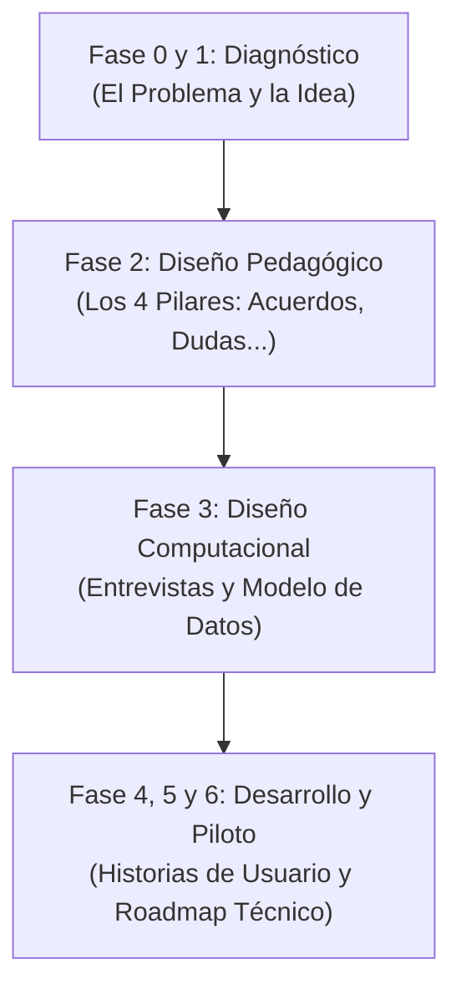

# 🎓 Guía de Estudio y Presentación de SICOCO

## 🚀 Evolución, Colaboración y Estado Final del Proyecto

Este documento sirve como resumen ejecutivo y guion de estudio para presentar el proyecto **SICOCO** (*Sintetizador de Co-creación Colaborativa*). Explica cómo nació el proyecto, cómo evolucionó gracias al trabajo conjunto entre tú y la IA, y cuál es el estado final de la propuesta.

---

## 🗺️ 1. Cronología y Evolución del Proyecto

El proyecto se estructuró siguiendo estrictamente la metodología **MODESEC** (Modelo de Organización de Estrategias para el Desarrollo de Software Educativo por Competencias) para asegurar que el software no sea solo técnico, sino que tenga un **propósito pedagógico**.

### 📈 Tabla de Hitos de Documentación

| Archivo | Fase / Tema | Contenido Clave |
| :--- | :--- | :--- |
| **00_documento_base.md** | General / Introducción | Contexto del 8vo semestre, el problema de sobrecarga y el alcance del MVP. |
| **01 a 06_fases.md** | Fases MODESEC | El desglose paso a paso de la metodología aplicada al desarrollo. |
| **07A, 07B, 07_entrevista.md** | Requerimientos | Entrevistas simuladas con un Arquitecto de Datos para extraer necesidades del sistema. |
| **08_historias_usuario.md** | Requisitos Funcionales | Matriz de historias divididas por zonas (Usuarios, Sesiones, IA, GUI, Seguridad). |
| **09_fundamentacion.md** | Fundamentación Pedagógica | Explicación detallada de cómo SICOCO impacta el aprendizaje colaborativo. |
| **10_modelo_entidad_relacion.md** | Arquitectura de Datos | Mapeo detallado de las 19 tablas y relaciones lógicas de la base de datos. |
| **11_comparativa_modelo.md** | Validación técnica | Matriz de trazabilidad que demuestra que la BD cubre todo lo dicho en las entrevistas. |
| **12_desarrollo_tecnico.md** | Arquitectura y Flujos | La definición tecnológica (Extensión de navegador + IA APIs + Dashboard). |

---

## 🤝 2. División del Trabajo: ¿Quién hizo qué?

El proyecto es el resultado de una colaboración ágil. Así se dividió la construcción:

### 🤖 Lo que hizo la IA (Antigravity)

* **Estructuración MODESEC:** Crear y normalizar las plantillas de las fases iniciales del proyecto.
* **Modelo de Base de Datos:** Diseñar y normalizar las 19 entidades en formato DBML (`diagrama_bd.dbml`), asegurando llaves foráneas y consistencia de datos.
* **Trazabilidad:** Generar matrices comparativas entre las entrevistas y el modelo de datos para evitar vacíos de información.
* **Estructura Técnica:** Definir la viabilidad técnica como extensión de navegador y flujos de conexión con APIs de IA.

### 👤 Lo que añadiste tú (Jose Daniel - Manualmente)

* **Refinamiento de Contenido:** Ajustar la redacción para adaptarla al contexto académico real y a las necesidades de la Universidad de Córdoba.
* **Estilo y Formato (Prettier):** Corregir el formato de los archivos markdown para que tengan una estética limpia y legible.
* **Ajuste de Errores y Nomenclatura:** Modificar campos específicos en el diseño de datos, corregir nombres de carpetas e integrar archivos visuales finales (`Modelo Relacion - Entidad V2.png`, `DBDiagram.png`, `Modelo Relacion - Entidad V2pdf.pdf`).
* **Coherencia y Decisiones:** Decidir la simplificación del MVP para que sea una extensión de navegador viable y no un software sobredimensionado.

---

## 🛠️ 3. Estado Final de SICOCO (¿Qué es hoy?)

SICOCO es un **Producto Mínimo Viable (MVP)** en formato de **Extensión de Navegador** (Chromium).

### 💡 Los 4 Pilares del Resumen Inteligente

1. **✅ Acuerdos:** Qué decidió el grupo.
2. **❌ Desacuerdos:** Debates y posturas encontradas.
3. **❓ Dudas Abiertas:** Preguntas que nadie respondió.
4. **📋 Tareas (To-Do):** Quién hace qué y para cuándo.

### 🗄️ La Base de Datos (19 Tablas Normalizadas)

Para soportar esto sin perder información, la base de datos se estructuró en áreas lógicas:

* **Académica:** `Estudiante`, `Profesor`, `Curso`, `Equipo`, `Miembro_Equipo`.
* **Mensajería:** `Sesion_Trabajo`, `Registro_Chat`, `Mensaje_Original`.
* **Procesamiento:** `Configuracion_Prompt`, `Resumen_Generado`.
* **Resultados IA:** `Acuerdo_Equipo`, `Desacuerdo`, `Duda_Abierta`, `Tarea_Asignada`.
* **Línea de Tiempo:** `Momento_Clave_Chat` y la tabla recursiva (auto-relación) `Conexion_Idea` (para unir qué ideas inspiraron a otras).
* **Evaluación/UX:** `Control_Calidad_Bot`, `Evaluacion_UX`, `Encuesta_Piloto`.

---

## 🎤 4. Guion de Exposición Rápida (Pitch de 5 Minutos)

Utiliza este guion estructurado para tu defensa del proyecto:

### ⏱️ Minuto 1: Introducción y El Problema
>
> *"Buenos días. Nuestro proyecto es SICOCO, una herramienta diseñada bajo la metodología MODESEC. Al trabajar en grupo de forma virtual (por WhatsApp o Discord), los estudiantes sufren de sobrecarga de información y las ideas importantes se pierden en el chat. SICOCO soluciona esto extrayendo el valor pedagógico de las conversaciones."*

### ⏱️ Minuto 2: La Solución y el Enfoque MODESEC
>
> *"SICOCO no es solo un resumidor. Transforma el chat en evidencias de aprendizaje. Identifica de forma clara los acuerdos, desacuerdos, dudas abiertas y tareas asignadas a cada estudiante. De esta forma, el docente puede ver el nivel de participación real y los estudiantes pueden llevar una ruta de trabajo clara."*

### ⏱️ Minuto 3: Arquitectura y Base de Datos
>
> *"Para dar soporte a esto, diseñamos una base de datos de 19 tablas. Destacamos tres decisiones clave: Primero, desacoplamos los nombres de los chats usando aliases para que la extensión procese mensajes de personas no registradas sin romperse. Segundo, creamos una relación recursiva para conectar ideas cronológicas y construir la línea de tiempo. Y tercero, aislamos las tablas de evaluación y encuestas para medir el impacto real en el aprendizaje."*

### ⏱️ Minuto 4: La Tecnología (MVP)
>
> *"SICOCO funciona como una extensión de navegador. Lee el DOM de la pestaña web (WhatsApp Web por ejemplo), envía el texto limpio mediante ingeniería de prompts a la API de Inteligencia Artificial (Gemini/OpenAI) y devuelve la información estructurada en un Dashboard interactivo de co-creación."*

### ⏱️ Minuto 5: Conclusión y Cierre
>
> *"En resumen, SICOCO une la inteligencia artificial con el diseño instruccional MODESEC para potenciar el aprendizaje colaborativo. Estamos listos para iniciar pruebas piloto con estudiantes de la Universidad de Córdoba. Muchas gracias, quedamos abiertos a sus preguntas."*
