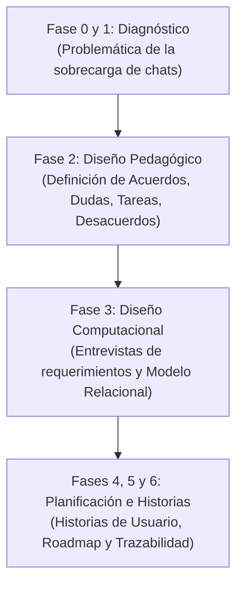

# 🎓 Guía de Estudio y Presentación de SICOCO

## 🚀 Evolución, Colaboración y Estado del Proyecto (Solo Diseño y Documentación)

Este documento sirve como resumen ejecutivo y guion de estudio para presentar el proyecto **SICOCO** (*Sintetizador de Co-creación Colaborativa*). Explica cómo nació el proyecto, cómo evolucionó gracias al trabajo conjunto entre el equipo de estudiantes y el asistente de IA, y cuál es el estado real y el alcance logrado al cierre de este semestre.

---

## 🗺️ 1. Cronología y Evolución del Proyecto

El proyecto se estructuró siguiendo estrictamente la metodología **MODESEC** (Modelo de Organización de Estrategias para el Desarrollo de Software Educativo por Competencias) para asegurar que la futura herramienta no sea solo técnica, sino que tenga un **propósito pedagógico** que fortalezca el aprendizaje colaborativo.

### 📈 Tabla de Hitos de Documentación

| Archivo | Fase / Tema | Contenido Clave Detallado |
| :--- | :--- | :--- |
| **00_documento_base.md** | General / Introducción | Establece el contexto del 8vo semestre, diagnostica el problema de la sobrecarga de información que sufren los estudiantes al coordinar trabajos grupales por chats asíncronos, y define los objetivos del proyecto. |
| **01 a 06_fases.md** | Fases MODESEC | Guía secuencial del ciclo de vida del software educativo, detallando cómo se evalúan las competencias, las mediaciones tecnológicas y los indicadores pedagógicos propuestos para SICOCO. |
| **07A_entrevista_preguntas.md** y **07B_respuestas.md** | Requerimientos | Levantamiento de requerimientos a través de un cuestionario de 20 preguntas que simula una entrevista con un Arquitecto de Datos para extraer las entidades y relaciones del sistema. |
| **07_entrevista_arquitectura_datos_OG.md** | Estructura Inicial | Documento preliminar con las respuestas de datos crudos sobre las cuales se diseñaron las tablas y flujos lógicos de mensajería del sistema. |
| **08_historias_usuario.md** | Requisitos Funcionales | Matriz con historias de usuario y criterios de aceptación específicos agrupados en 5 zonas (Usuarios, Sesiones, IA, Dashboard y Seguridad/Evaluación). |
| **09_fundamentación_metodológica.md** | Fundamento Pedagógico | Análisis detallado de cómo SICOCO impacta y apoya el aprendizaje colaborativo basándose en competencias e ingeniería de prompts adaptada a la taxonomía educativa. |
| **10_modelo_entidad_relación.md** | Diseño de Base de Datos | Definición formal de las 19 tablas de la base de datos (académicas, de procesamiento, resultados de IA y auditoría), detallando llaves, cardinalidades y restricciones. |
| **11_comparativa_modelo_entrevista.md** | Validación de Datos | Matriz de trazabilidad que cruza las preguntas de la entrevista de datos con las tablas relacionales para certificar que el diseño cubre todas las necesidades lógicas del proyecto. |
| **12_desarrollo_técnico.md** | Arquitectura del MVP | Definición técnica de la futura arquitectura del sistema, proponiendo una extensión de navegador Chromium que use APIs de IA (Gemini/OpenAI) y muestre un Dashboard visual. |

---

## 🤝 2. División del Trabajo: ¿Quién hizo qué?

El diseño del proyecto es el resultado de un flujo colaborativo e iterativo entre el equipo de estudiantes y el asistente de Inteligencia Artificial.

### 🤖 Lo que hizo la IA (Antigravity)

* **Generación de Estructuras Base:** Diseñar las plantillas iniciales basadas en el estándar de MODESEC.
* **Modelo Relacional Lógico (DBML):** Normalizar y estructurar las 19 entidades en código DBML (`diagrama_bd.dbml`) y validar las relaciones entre tablas para evitar desconnectiones lógicas (como la vinculación de `Configuracion_Prompt`).
* **Matrices de Trazabilidad:** Comparar de forma automatizada las preguntas de requerimientos con el modelo físico de base de datos.
* **Especificaciones Técnicas:** Traducir las necesidades pedagógicas a componentes de software y flujos lógicos de APIs de lenguaje de gran tamaño (LLM).

### 👥 Lo que añadieron tú y tu equipo de compañeros (Manualmente)

* **Refinamiento de Contenido:** Contextualizar las definiciones del proyecto a la realidad de la Licenciatura en Informática con énfasis en Medios Audiovisuales de la Universidad de Córdoba.
* **Estilo y Formato (Prettier):** Corregir, limpiar y dar formato markdown uniforme a todos los archivos para asegurar que la visualización final sea limpia.
* **Ajuste de Errores y Nomenclatura:** Corregir inconsistencias de nombres en el diseño de datos, ajustar nombres de directorios e incorporar los recursos visuales del modelado de datos (`Modelo Relacion - Entidad V2.png`, `DBDiagram.png`, `Modelo Relacion - Entidad V2pdf.pdf`).
* **Justificación de Decisiones:** Validar y refinar las implicaciones del proyecto para asegurar su aplicabilidad real en la materia Diseño y Desarrollo de Software Educativo I.

---

## 🛠️ 3. Estado del Proyecto al Cierre del Semestre (Solo Diseño)

Es importante enfatizar que **SICOCO no cuenta con un prototipo de software programado o MVP ejecutable en este momento**. El trabajo desarrollado se centró en la **planificación, fundamentación metodológica y diseño arquitectónico**.

Lo que se encuentra en el repositorio de GitHub es la documentación de diseño lista para que, **en el próximo semestre**, se pueda proceder con la programación y construcción física del MVP (la Extensión de Navegador).

### 💡 Diseño de los 4 Pilares del Resumen Inteligente

1. **✅ Acuerdos:** Identificación de decisiones y consensos grupales.
2. **❌ Desacuerdos:** Registro de debates y posturas encontradas.
3. **❓ Dudas Abiertas:** Listado de preguntas que no se resolvieron en la sesión.
4. **📋 Tareas (To-Do):** Asignación de actividades con responsables y plazos.

### 🗄️ Diseño de la Base de Datos (19 Tablas Normalizadas)

El modelado de datos estructurado para soportar el procesamiento está listo e incluye:

* **Área Académica:** `Estudiante`, `Profesor`, `Curso`, `Equipo`, `Miembro_Equipo`.
* **Área de Captura:** `Sesion_Trabajo`, `Registro_Chat`, `Mensaje_Original`.
* **Área de Inteligencia:** `Configuracion_Prompt`, `Resumen_Generado`.
* **Área de Resultados:** `Acuerdo_Equipo`, `Desacuerdo`, `Duda_Abierta`, `Tarea_Asignada`.
* **Área de Visualización (Línea de Tiempo):** `Momento_Clave_Chat` y la tabla reflexiva `Conexion_Idea` (auto-relación para conectar qué ideas se alimentan de otras).
* **Área de Evaluación y UX:** `Control_Calidad_Bot`, `Evaluacion_UX`, `Encuesta_Piloto`.

---

## 🎤 4. Guion de Exposición Rápida (Pitch de 5 Minutos)

Utiliza este guion estructurado para tu defensa del proyecto:

### ⏱️ Minuto 1: Introducción y El Problema
>
> *"Buenos días. Nuestro proyecto es SICOCO, una propuesta diseñada bajo la metodología MODESEC. En la educación actual, los estudiantes realizan gran parte de su trabajo grupal en chats asíncronos como WhatsApp o Discord. Sin embargo, esto genera una sobrecarga de información donde las ideas valiosas y los compromisos se pierden en extensas cadenas de mensajes. SICOCO nace para estructurar pedagógicamente estas interacciones."*

### ⏱️ Minuto 2: La Metodología y Enfoque Pedagógico
>
> *"SICOCO no se concibe como un simple resumidor de texto comercial. Bajo la guía de MODESEC, su objetivo es extraer evidencias de aprendizaje del trabajo colaborativo. El diseño se enfoca en clasificar la información en cuatro pilares: acuerdos alcanzados, desacuerdos surgidos, dudas sin resolver y tareas asignadas. De esta forma, el docente puede realizar un seguimiento formativo real y los estudiantes pueden reflexionar sobre su propio proceso de co-creación."*

### ⏱️ Minuto 3: Arquitectura y Diseño de la Base de Datos
>
> *"Para dar soporte a esta lógica, diseñamos una base de datos normalizada con 19 tablas. Tomamos tres decisiones críticas en el diseño: Primero, desacoplamos los remitentes del chat original mediante aliases para procesar mensajes de usuarios no registrados sin vulnerar la integridad de la base de datos. Segundo, creamos una relación recursiva en los momentos clave para poder rastrear cronológicamente cómo una idea inspira a otra. Y tercero, incorporamos tablas de control de calidad del bot y encuestas para validar la utilidad del sistema."*

### ⏱️ Minuto 4: Planificación Técnica y el MVP del Próximo Semestre
>
> *"La arquitectura técnica propone implementar SICOCO en el futuro como una extensión de navegador. El flujo diseñado establece que la extensión leerá el DOM de las pestañas web activas (por ejemplo, WhatsApp Web), limpiará el texto, lo enviará con una ingeniería de prompts estructurada a la API de un modelo de lenguaje (como Gemini o GPT) y finalmente poblará la base de datos para mostrar los resultados en un Dashboard interactivo."*

### ⏱️ Minuto 5: Estado Actual y Conclusión
>
> *"Queremos aclarar que el alcance logrado este semestre corresponde al 100% de la fase de planificación y diseño documental que se encuentra en nuestro GitHub. No hay un prototipo funcional programado aún; en su lugar, hemos construido los cimientos teóricos, instruccionales y relacionales del sistema. Con este diseño consolidado como hoja de ruta, iniciaremos la programación y el desarrollo del MVP el próximo semestre. Muchas gracias, quedamos abiertos a sus preguntas."*
